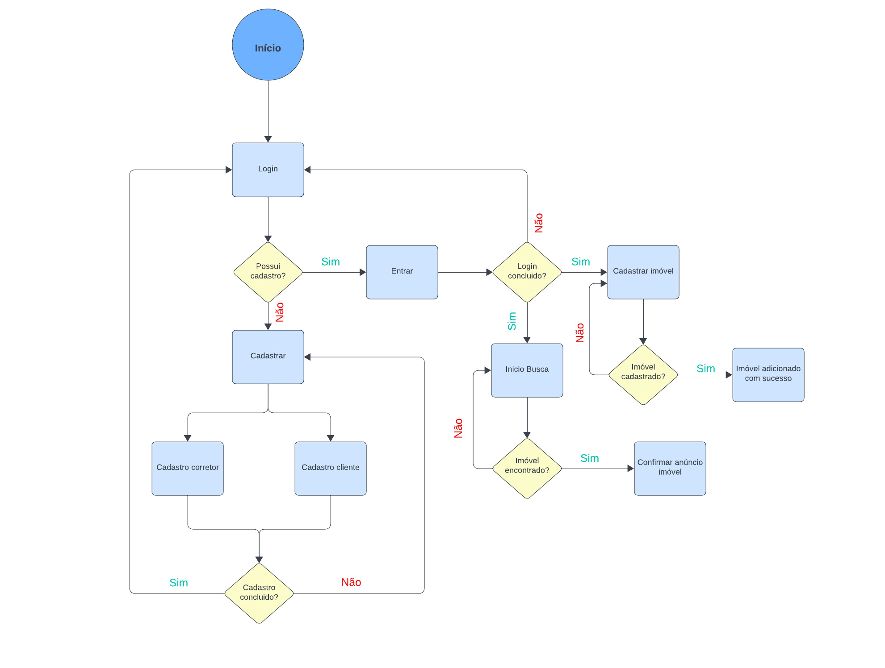
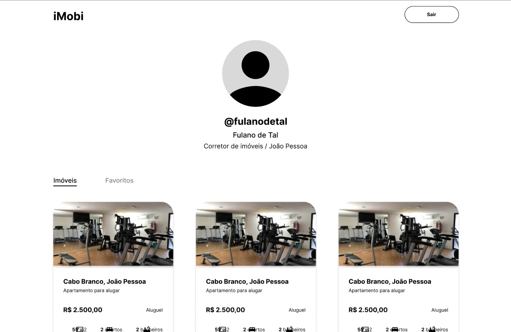

# Projeto de Interface

Pré-requisitos: <a href="2-Especificação do Projeto.md"> Documentação de Especificação</a>

Visão geral da interação do usuário pelas telas do sistema e protótipo interativo das telas com as funcionalidades que fazem parte do sistema (wireframes).

 Apresente as principais interfaces da plataforma. Discuta como ela foi elaborada de forma a atender os requisitos funcionais, não funcionais e histórias de usuário abordados nas <a href="2-Especificação do Projeto.md"> Documentação de Especificação</a>.

## Diagrama de Fluxo

O diagrama apresenta o estudo do fluxo de interação do usuário com o sistema interativo e muitas vezes sem a necessidade do desenho do design das telas da interface. Isso permite que o design das interações seja bem planejado e gere impacto na qualidade no design do wireframe interativo que será desenvolvido logo em seguida.

As referências abaixo irão auxiliá-lo na geração do artefato “Diagramas de Fluxo”.

> **Links Úteis**:
> - [Fluxograma online: seis sites para fazer gráfico sem instalar nada | Produtividade | TechTudo](https://www.techtudo.com.br/listas/2019/03/fluxograma-online-seis-sites-para-fazer-grafico-sem-instalar-nada.ghtml)

## Wireframes

 São protótipos usados em design de interface para sugerir a estrutura de um site web e seu relacionamentos entre suas páginas. Um wireframe web é uma ilustração semelhante do layout de elementos fundamentais na interface.
 Ao desenvolver nossos wireframes, elaboramos cuidadosamente as principais telas que compõem a experiência do usuário. Este conjunto abrange desde as fases iniciais, como cadastro e login, até as interações diárias, representadas pela página inicial, o perfil do usuário e o feed contendo os imóveis em anúncio. Essa estruturação visa proporcionar uma jornada fluida e intuitiva, garantindo uma navegação eficiente e agradável aos usuários que exploram nossa plataforma.

### *Figura 1 
- **Tela de estrutura padrão**

Para a tela de início da aplicação, onde os usuários podem pesquisar endereços de imóveis, bem como selecionar alguns filtros. Aqui estão alguns:

Barra de Pesquisa:

-Encontre seu Lar: Uma barra de pesquisa centralizada na tela convidando os usuários a encontrar o lar ideal.
Apartamentos Mais Vistos:

-Destaques da Semana: Destaque alguns apartamentos que são os mais vistos durante a semana. Pode incluir uma imagem atraente, preço e breve descrição.
Mais Recentes:

-Novidades no Mercado: Destaque os apartamentos mais recentes adicionados à plataforma. Isso ajuda os usuários a ficarem atualizados sobre as novas opções disponíveis.
Categorias Populares:

-Explore por Categoria: Crie categorias como "Apartamentos", "Casas", "Condomínios", etc. para facilitar a navegação.

### *Figura 2 

 **Tela de Cadastro**

Temos uma tela dedicada ao cadastro do usuário na aplicação, que inclui campos essenciais como nome, e-mail, CPF e, quando aplicável, o CRECI, especialmente para corretores.

### *Figura 3 

**Tela de Login**

Efetuar a autenticação do usuário através do preenchimento dos campos email e senha. Caso seja o primeiro acesso, o usuário deverá realizar o cadastro por meio da aba "*Cadastrar*". Caso o usuário precise redefinir senha, ele pode acessar o link “*recuperar senha*”.

### *Figura 4 

**Tela de usúario**

Na área dedicada ao usuário, é possível cadastrar e excluir imóveis, além de editar informações pessoais, proporcionando controle total sobre sua experiência na aplicação.

### *Figura 5

**Tela de feed**
Na tela de feed, os imóveis são apresentados de acordo com o filtro aplicado, proporcionando uma visualização personalizada e alinhada às preferências definidas.

> **Links Úteis**:
> - [Protótipos vs Wireframes](https://www.nngroup.com/videos/prototypes-vs-wireframes-ux-projects/)
> - [Ferramentas de Wireframes](https://rockcontent.com/blog/wireframes/)
> - [MarvelApp](https://marvelapp.com/developers/documentation/tutorials/)
> - [Figma](https://www.figma.com/)
> - [Adobe XD](https://www.adobe.com/br/products/xd.html#scroll)
> - [Axure](https://www.axure.com/edu) (Licença Educacional)
> - [InvisionApp](https://www.invisionapp.com/) (Licença Educacional)
